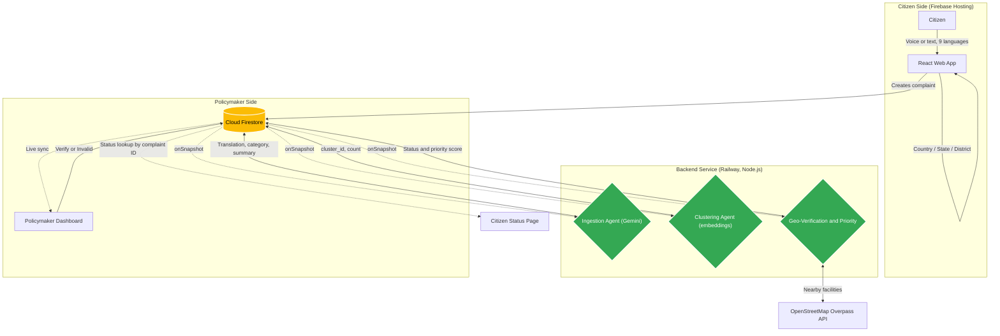
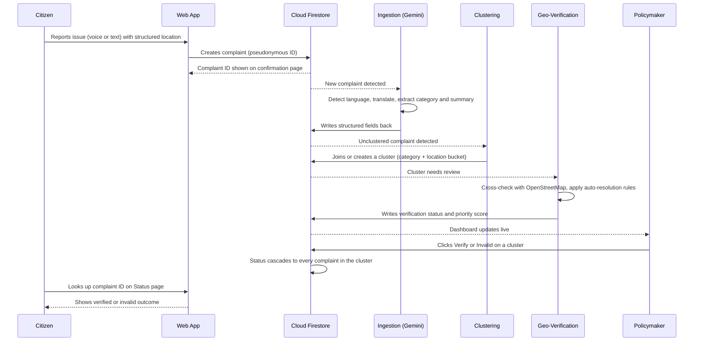

<div align="center">

  # Pledoc
  ### A Multilingual Citizen Feedback Platform for BRICS Nations

  <a href="VIDEO_LINK_HERE"></a>
  <a href="https://pledoc-app.web.app"></a>

  <br />

  [](https://vitejs.dev/)
  [](https://www.typescriptlang.org/)
  [](https://firebase.google.com/)
  [](https://deepmind.google/technologies/gemini/)
  [](https://railway.com/)

  <br />

  *Pledoc turns scattered, multilingual citizen complaints about water, roads, electricity and sanitation into verified, clustered and prioritized signals that national policymakers can act on.*

</div>

---

## 📖 Table of Contents
- [The Problem Statement](#-the-problem-statement)
- [Our Solution](#-our-solution)
- [System Architecture](#-system-architecture)
- [Application Flow & Data Lifecycle](#-application-flow--data-lifecycle)
- [Pages & Data Model](#-pages--data-model)
- [Backend Services](#-backend-services)
- [Tech Stack Breakdown](#-tech-stack-breakdown)
- [Reliability & Known Limitations](#-reliability--known-limitations)
- [Getting Started](#-getting-started)
- [Team](#-team)

---

## 🚨 The Problem Statement

BRICS nations together serve billions of people, and the gaps that matter most in daily life (a dry tap, a broken road, an unreliable power line) are reported the least in a form that policymakers can use:

1. **Language barriers:** Citizens describe problems in their own language, and national dashboards work in one or two.
2. **Unstructured, duplicated reports:** The same broken pipe is reported dozens of times in different words, with no way to tell it is one issue.
3. **No verification:** Policymakers cannot tell a real, widespread gap from a one-off or already-resolved report.
4. **No feedback loop:** Citizens rarely find out whether anyone looked at what they reported.

---

## 💡 Our Solution

**Pledoc** is a multilingual, AI-assisted feedback pipeline with two sides:

**For the citizen:**
Report an issue by voice or text in one of 9 languages, pick a real administrative location (Country → State/Province → District/Ward/Locality), and receive a complaint ID. Later, look that ID up on the status page to see whether the report was reviewed and what the outcome was.

**For the policymaker:**
A live dashboard of *clusters*, not raw reports. AI translates and structures each complaint, groups similar ones by category, location and semantic similarity, cross-checks each cluster against open map data, and assigns a priority score. The policymaker then verifies or invalidates a cluster, and that decision flows back to every citizen complaint inside it.

**Languages (9):**

| Tier | Languages |
| :--- | :--- |
| Primary (fully translated) | English, Hindi, Mandarin, Portuguese, Russian, Zulu |
| Secondary (functional) | Arabic, Persian, Amharic |

---

## 🏗 System Architecture



---

## 🔄 Application Flow & Data Lifecycle



---

## 🗺 Pages & Data Model

### Application pages

| Route | Purpose |
| :--- | :--- |
| `/` | Language selection |
| `/home` | Entry point: report an issue or check status |
| `/report` | Voice or text report with live voice-transcript preview and structured location input |
| `/confirmation` | Shows the complaint ID after submission |
| `/status` | Looks up a complaint by its complaint ID and shows its current outcome |
| `/dashboard` | Policymaker dashboard of clusters (English only) |

### Firestore collections

**`complaints`**

| Field | Description |
| :--- | :--- |
| `category` | Water, Roads, Electricity or Sanitation |
| `location` | Structured administrative location entered by the citizen |
| `issue_summary` | AI-written one-line summary |
| `transcript` / `translated_transcript_en` | Original text and its English translation |
| `language` | Detected language code |
| `pseudonymous_id` | Anonymous submitter identifier |
| `cluster_id` | The cluster this complaint belongs to |
| `verification_status` | `needs_review`, `verified` or `invalid` |
| `priority_score` | Inherited from the cluster |
| `processing_status` / `processed_at` | Ingestion pipeline state |
| `created_at` | Submission time |

**`clusters`**

| Field | Description |
| :--- | :--- |
| `category` / `location_bucket` / `country` | What the cluster groups together, and where |
| `count` | Number of complaints in the cluster |
| `embedding` | Semantic vector used for similarity merging |
| `verification_status` | `needs_review`, `verified` or `invalid` |
| `infra_gap_severity` / `priority_score` | Inputs and output of prioritization |

> **Cascade rule:** when a policymaker verifies or invalidates a cluster, its status and priority score are written to every complaint with that `cluster_id`. This is what makes the citizen-facing `/status` lookup reflect the real decision.

---

## ⚙️ Backend Services

The backend runs as one persistent Node.js service on Railway. Three Firestore `onSnapshot` watchers run inside it:

| Service | Trigger | What it does |
| :--- | :--- | :--- |
| **Ingestion (Gemini)** | New complaint | One structured Gemini call detects the language, translates to English, and extracts the category and issue summary, then writes them back to the complaint. |
| **Clustering** | Unclustered, ready complaint | Groups by category and location bucket, then merges near-duplicates using Gemini embedding similarity. Creates a new cluster or joins an existing one and keeps `count` accurate. |
| **Geo-verification and prioritization** | Cluster in `needs_review` | Cross-checks the location against OpenStreetMap (Overpass), applies auto-resolution rules (for example, a small cluster in an area with many mapped facilities and no corroborating signal is marked likely-false or resolved), and assigns a priority score. The final call stays with the policymaker. |

---

## 🛠 Tech Stack Breakdown

### **Frontend & Client**
- **React + Vite + TypeScript:** Fast, strictly typed UI, with `react-router-dom` for routing.
- **Tailwind CSS:** Design system with three accent colors: indigo for citizen-facing screens, teal for AI and data processing, rust for decisions and output.
- **Web Speech API:** Live voice-transcript preview while the citizen speaks. It is a convenience preview, not the authoritative transcript.
- **Firebase JS SDK:** Real-time Firestore reads and writes from the client.

### **Backend & Infrastructure**
- **Cloud Firestore (`asia-south1`):** Shared real-time state between the citizen app, the backend watchers and the dashboard.
- **Firebase Hosting:** Serves the frontend at `pledoc-app.web.app`.
- **Node.js on Railway:** Runs the three long-lived watchers (see [Backend Services](#-backend-services)).
- **OpenStreetMap Overpass API:** Free, open map data for geo-verification.

### **Artificial Intelligence**
- **Gemini Flash (`gemini-3.6-flash`):** Language detection, translation, and structured field extraction in a single JSON-returning prompt.
- **Gemini embeddings:** Semantic vectors for clustering similar complaints across phrasing and language.

---

## 🛡️ Reliability & Known Limitations

**What is built in:**
- **Retry sweep for AI failures:** If a Gemini call fails (503 "high demand" or 429 rate limit), the complaint is retried every 2 minutes, up to 3 retries, then flagged for manual review. Nothing silently disappears.
- **Independent stages:** Clustering does not wait on ingestion, so a Gemini outage still lets complaints be grouped by their structured location and category.
- **Decision cascade:** Cluster-level decisions always propagate to complaint-level documents, so the citizen-facing status never drifts from the dashboard.

**Known limitations (honest notes):**
- **Gemini free tier:** The API key is on the free tier, which allows about 20 requests per day per model. Heavy testing can hit this limit, and affected complaints are held for retry or manual review.
- **Hosting credit:** The Railway backend runs on Railway's one-time trial credit (about $4.60, 27 days remaining as of Sept 30, 2026). If the credit has run out when you read this, new submissions are still saved to Firestore but not processed until the service is restarted with credit. The frontend and stored data on Firebase are unaffected.
- **Why Railway:** The Firebase Spark plan does not allow deployed Cloud Function triggers. In production, this backend would move to Cloud Functions on the Blaze plan.
- **Geo-verification is heuristic:** Map coverage varies by region, so sparse areas produce weaker signals.
- **Voice accuracy:** The in-browser transcript is a live preview. Storing raw audio for direct Gemini transcription is a planned improvement.
- **Not built yet:** WhatsApp ingestion (Twilio sandbox, then the full WhatsApp Business API) is future work. The dashboard is English-only.

---

## 🚀 Getting Started

### Prerequisites
- Node.js
- A Firebase project with Firestore enabled
- A Gemini API key (backend only, never exposed to the browser)

### Run the frontend

```bash
git clone https://github.com/dev-duet/pledoc-app.git
cd pledoc-app
npm install
npm run dev
```

Add your Firebase web configuration in a local `.env` file before running. Production build:

```bash
npm run build
```

### Run the backend

The backend needs your Gemini API key and Firebase service-account credentials as environment variables. Install its dependencies and run it with the same start command configured on Railway. It should log three lines confirming the ingestion, clustering and geo-verification watchers are running.

---

## 👥 Team

Built by **dev-duet**, two developers working in parallel on separate tracks:
- **Ingestion and understanding:** multilingual Gemini pipeline, retry handling, backend service
- **Verification and prioritization:** geo-verification, clustering and priority scoring

<div align="center">
  <br/>
  <b>Pledoc: giving every citizen's report a voice that policymakers can act on.</b>
</div>
