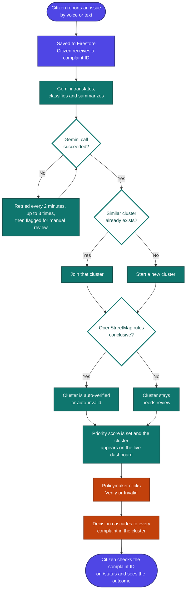

<div align="center"> 
  <!-- This is the exact shield logo code from your website -->
  <svg xmlns="http://www.w3.org/2000/svg" width="180" height="180" viewBox="0 0 24 24" fill="none" stroke="#4F46E5" stroke-width="2" stroke-linecap="round" stroke-linejoin="round">
    <path d="M20 13c0 5-3.5 7.5-7.66 8.95a1 1 0 0 1-.67 0C7.5 20.5 4 18 4 13V6a1 1 0 0 1 1-1c2 0 4.5-1.2 6.24-2.72a1.17 1.17 0 0 1 1.52 0C14.5 4.8 17 6 19 6a1 1 0 0 1 1 1Z"></path>
    <path d="m9 12 2 2 4-4"></path>
  </svg>
</div>

  # Pledoc
  ### A Multilingual Citizen Feedback Platform for BRICS Nations

  <a href="VIDEO_LINK_HERE"></a>
  <a href="https://pledoc-app.web.app"></a>

  <br />

  [](https://vitejs.dev/)
  [](https://www.typescriptlang.org/)
  [](https://firebase.google.com/)
  [](https://deepmind.google/technologies/gemini/)
  [](https://railway.com/)

  <br />

  *Pledoc turns scattered, multilingual citizen complaints about water, roads, electricity and sanitation into verified, clustered and prioritized signals that national policymakers can act on.*

</div>

---

## 📖 Table of Contents
- [The Problem Statement](#-the-problem-statement)
- [Our Solution](#-our-solution)
- [System Architecture](#-system-architecture)
- [Pages & Data Model](#-pages--data-model)
- [Backend Services](#-backend-services)
- [Tech Stack Breakdown](#-tech-stack-breakdown)
- [Reliability & Known Limitations](#-reliability--known-limitations)
- [Getting Started](#-getting-started)

---

## 🚨 The Problem Statement

The gaps that matter most in daily life (a dry tap, a broken road, an unreliable power line) are the hardest for governments to see in a usable form:

1. **Language barriers:** Citizens describe problems in their own language, while national systems work in one or two.
2. **Duplicated, unstructured reports:** The same broken pipe is reported dozens of times in different words, with no way to tell it is one issue.
3. **No verification:** Policymakers cannot tell a real, widespread gap from a one-off or already-resolved report.
4. **No feedback loop:** Citizens rarely learn whether anyone looked at what they reported.

---

## 💡 Our Solution

Pledoc is a multilingual, AI-assisted pipeline that runs from a citizen's phone to a policymaker's dashboard and back.

| Step | What happens |
| :--- | :--- |
| **1. Report** | A citizen reports an issue by voice or text in one of 9 languages, picks their country and state, and receives a complaint ID. |
| **2. Understand** | Gemini cleans the transcript, detects the language, translates to English, classifies the issue and writes a one-line summary. |
| **3. Cluster and verify** | Similar reports are merged into one cluster, then cross-checked against OpenStreetMap and scored for priority. |
| **4. Decide** | A policymaker verifies or invalidates each cluster. The decision cascades to every complaint inside it. |
| **5. Close the loop** | The citizen looks up their complaint ID and sees the outcome. |

**Languages (9):**

| Tier | Languages |
| :--- | :--- |
| Primary (fully translated) | English, Hindi, Mandarin, Portuguese, Russian, Zulu |
| Secondary (functional) | Arabic, Persian, Amharic |

**Countries (10):** Brazil, Russia, India, China, South Africa, Egypt, Ethiopia, Iran, Saudi Arabia, UAE.

> **🎙️ Reporting by voice in another language?** Switch the site language first (language switcher, top right), then tap the mic. Speech recognition follows the selected site language, so speaking Hindi while the site is set to English will be transcribed poorly. Chrome gives the best speech-recognition support.

---

## 🏗 System Architecture

From a citizen's report to a policymaker's decision, and back to the citizen:



<sub>🟣 citizen-facing · 🟢 AI and data processing · ⬜ automated decision · 🟠 policymaker decision. Every stage reads and writes one shared Cloud Firestore database, so all screens update live.</sub>

---

## 🗺 Pages & Data Model

### Application pages

| Route | Purpose |
| :--- | :--- |
| `/` | Language selection |
| `/home` | Choose: report an issue or check status |
| `/report` | Text or voice report. Country and State/Province come from dropdowns of real administrative divisions; district, ward or locality is typed in (optional). Voice reports show a live transcript preview, and the citizen reviews the details before submitting. |
| `/confirmation` | Shows the complaint ID (with a copy button) and a quick "similar reports" hint. The hint is a lightweight client-side count, not the real clustering result. |
| `/status` | Looks up a complaint by its **complaint ID** and shows its current outcome |
| `/dashboard` | Policymaker dashboard (English only): clusters sorted by priority, category or status, filtered by category or status, viewable by country, with expandable linked complaints and Verify / Invalid actions |

### Firestore collections

**`complaints`**

| Field | Description |
| :--- | :--- |
| `category` | Water, Roads, Electricity, Sanitation or Other. The citizen picks one, and Gemini re-classifies it. |
| `location` / `location_detail` | Location from the form, plus any extra detail (street, landmark) Gemini extracted from the text |
| `issue_summary` | One-line English summary |
| `transcript` / `translated_transcript_en` | Cleaned original transcript (voice reports) and its English translation |
| `language` | Detected language code |
| `pseudonymous_id` | Anonymous submitter ID stored in the browser |
| `cluster_id` | The cluster this complaint belongs to |
| `verification_status` | `needs_review`, `verified` or `invalid` |
| `priority_score` | Inherited from the cluster |
| `processing_status` | `processed`, `processing_failed` (being retried) or `needs_manual_review` |
| `created_at` / `processed_at` | Submission and processing times |

**`clusters`**

| Field | Description |
| :--- | :--- |
| `category` / `location_bucket` / `country` | What the cluster groups together, and where |
| `count` | Number of complaints in the cluster |
| `embedding` | Running-average semantic vector used for similarity matching |
| `verification_status` | `needs_review`, `verified` or `invalid` |
| `infra_gap_severity` / `priority_score` | Inputs and output of prioritization |

> **Cascade rule:** when a cluster's status changes, its status and priority score are written to every complaint with that `cluster_id`. This is what makes the citizen's `/status` lookup reflect the real decision.

---

## ⚙️ Backend Services

One persistent Node.js service on Railway runs three Firestore `onSnapshot` watchers side by side:

| Service | Trigger | What it does |
| :--- | :--- | :--- |
| **🧠 Ingestion (Gemini)** | New complaint | One structured Gemini call returns cleaned transcript, detected language, English translation, category, summary and location detail as JSON, then writes them back to the complaint. |
| **🧩 Clustering** | Complaint with no cluster yet | Buckets by category and coarse location, then compares Gemini embeddings (`gemini-embedding-001`) of the issue summary against the bucket's clusters. At 0.85 cosine similarity or higher it joins that cluster, otherwise it starts a new one. |
| **🗺️ Geo-verification and priority** | Cluster in `needs_review` | Geocodes the cluster (OpenStreetMap Nominatim), checks nearby facilities (Overpass API) and applies the rules below. |

**Auto-resolution rules** (a cluster that fits none of them stays with the policymaker):

| Situation | Outcome |
| :--- | :--- |
| 15 or more reports, all geo-tagged within 800 m of each other | ✅ Verified |
| No relevant facility (water point, substation, road and so on) within 6 km | ✅ Verified |
| 5 or fewer reports, but a relevant facility within 1.5 km and no corroboration | ❌ Invalid (likely false or already resolved) |
| Anything else, or the location can't be geocoded | 🕵️ Needs review |

**Priority score:**

```
priority = w1 × (report volume × verification multiplier)
         + w2 × infrastructure-gap severity
         + w3 × demographic weight
```

Default weights are 0.5, 0.35 and 0.15. They live in a Firestore config document, so they can be retuned without a code change.

---

## 🛠 Tech Stack Breakdown

### **Frontend & Client**
- **React 18 + Vite + TypeScript:** Fast, strictly typed UI with `react-router-dom` routing.
- **Tailwind CSS:** Three accent colors: indigo for citizen-facing screens, teal for AI and data processing, rust for decisions.
- **Web Speech API:** Live voice-transcript preview in the selected language. It is a preview, and Gemini cleans up the text afterwards.
- **Firebase JS SDK:** Real-time Firestore reads and writes. Right-to-left layout for Arabic and Persian.

### **Backend & Infrastructure**
- **Cloud Firestore (`asia-south1`):** Shared real-time state for the citizen app, the backend and the dashboard.
- **Firebase Hosting:** Serves the frontend at `pledoc-app.web.app`.
- **Node.js 24 on Railway:** Runs the three long-lived watchers from the `functions/` folder.
- **OpenStreetMap (Nominatim + Overpass):** Free, open geocoding and facility data.

### **Artificial Intelligence**
- **Gemini Flash (`gemini-3.6-flash`)** via `@google/genai`: Transcript cleanup, language detection, translation and structured extraction in a single JSON-returning prompt.
- **Gemini embeddings (`gemini-embedding-001`):** Semantic similarity for grouping duplicate reports across phrasing.

---

## 🛡️ Reliability & Known Limitations

**Built in:**
- **Retry sweep for AI failures:** If a Gemini call fails (503 or 429), the complaint is marked `processing_failed`, retried every 2 minutes up to 3 times, then flagged `needs_manual_review`. Nothing silently disappears.
- **Never guesses:** If geocoding or embedding fails, the cluster or complaint is left in place for review or retry instead of receiving a made-up result.
- **Keeps working through an AI outage:** The report form already captures category, location and description, so clustering can continue while Gemini is unavailable.
- **One crash never stops the others:** The three watchers share one process with global error handlers, and per-item failures are logged and skipped.
- **Concurrency-safe clustering:** Reports arriving at the same moment in the same bucket are processed one at a time so they don't create duplicate clusters.
- **Decision cascade:** Cluster decisions always propagate to complaint documents, so `/status` never drifts from the dashboard.

**Known limitations:**
- **Gemini free tier:** The API key allows about 20 requests per day per model, so heavy testing can hit the limit. Affected complaints are retried or flagged for manual review.
- **Hosting credit:** The backend runs on Railway's one-time trial credit (about $4.60, 27 days remaining as of Sept 30, 2026). If it has run out, new submissions are still saved to Firestore but not processed until the service is restarted with credit. The frontend and stored data on Firebase are unaffected.
- **Why Railway:** The Firebase Spark plan doesn't allow deployed Cloud Function triggers, so the same logic runs as a long-lived listener. It can move to Cloud Functions on the Blaze plan.
- **Placeholders:** The demographic weight is a neutral constant (0.5) and the official-registry cross-check is a stub. Both are designed to accept real per-country data sources later.
- **Geo-verification is heuristic:** Map coverage varies by region, so sparse areas give weaker signals. OpenStreetMap's geocoder is rate-limited to about one request per second.
- **Priority weights:** They are adjustable in Firestore, with no dashboard controls yet.
- **Voice:** Speech recognition quality depends on the browser and language. Storing raw audio for direct Gemini transcription is a planned improvement.
- **Not built yet:** WhatsApp intake (Twilio sandbox, then the full WhatsApp Business API) is future work. The dashboard is English-only.

---

## 🚀 Getting Started

### Prerequisites
- Node.js 24 (the backend requires it)
- A Firebase project with Firestore enabled
- A Gemini API key
- A Firebase **service-account key** (for the backend, see below)

### 1. Frontend

```bash
git clone https://github.com/dev-duet/pledoc-app.git
cd pledoc-app
npm install
cp .env.example .env
```

Fill in the six `VITE_FIREBASE_*` values from Firebase Console → Project settings → Your apps, then:

```bash
npm run dev          # local dev server
npm run typecheck    # TypeScript check
npm run build        # production build
```

### 2. Backend

```bash
cd functions
npm install
```

Create `functions/.env` with your two secrets:

```env
GEMINI_API_KEY=your-gemini-api-key
FIREBASE_SERVICE_ACCOUNT_JSON={"type":"service_account","project_id":"...", ...}
```

**Getting the Firebase service-account key:** Firebase Console → Project settings → **Service accounts** → **Generate new private key**. This downloads a `.json` file. Paste the entire contents onto a single line as the value of `FIREBASE_SERVICE_ACCOUNT_JSON`.

> ⚠️ **Never commit this key.** It grants full admin access to your Firestore. `functions/.gitignore` already excludes `.env` and `service-account*.json`, so if you keep a local copy of the file, name it `service-account.json` or keep it outside the repo. On Railway, set the same two values as service variables.

Start all three watchers in one process:

```bash
npm run listen:all
```

A healthy start logs three lines: `Listening for new complaints...`, `[clustering] Watching complaints collection...` and `[geo-verify] Watching clusters collection...`. Each module can also be run on its own (see the READMEs in `functions/src/clustering` and `functions/src/geoVerification`).

---

<div align="center">
  <br/>
  <b>Pledoc: giving every citizen's report a voice that policymakers can act on.</b>
</div>
